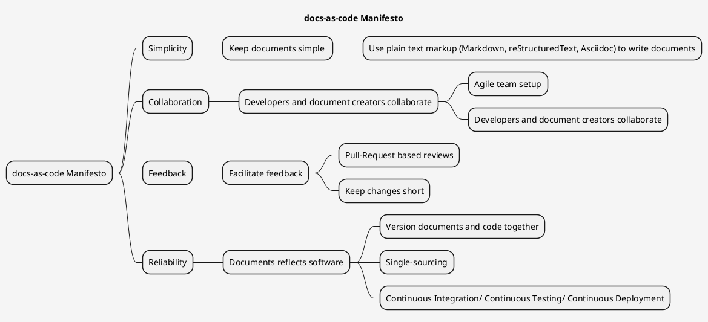

# docs-as-code Manifesto Mindmap

```plantuml
@startmindmap docs-as-code-manifesto
title docs-as-code Manifesto
skinparam backgroundColor whitesmoke
skinparam handwritten false
skinparam monochrome true
* docs-as-code Manifesto
** Simplicity
*** Keep documents simple 
****  Use plain text markup (Markdown, reStructuredText, Asciidoc) to write documents
** Collaboration
*** Developers and document creators collaborate
**** Agile team setup
**** Developers and document creators collaborate
** Feedback
*** Facilitate feedback
**** Pull-Request based reviews
**** Keep changes short
** Reliability
*** Documents reflects software
**** Version documents and code together
**** Single-sourcing
**** Continuous Integration/ Continuous Testing/ Continuous Deployment
@endmindmap
```